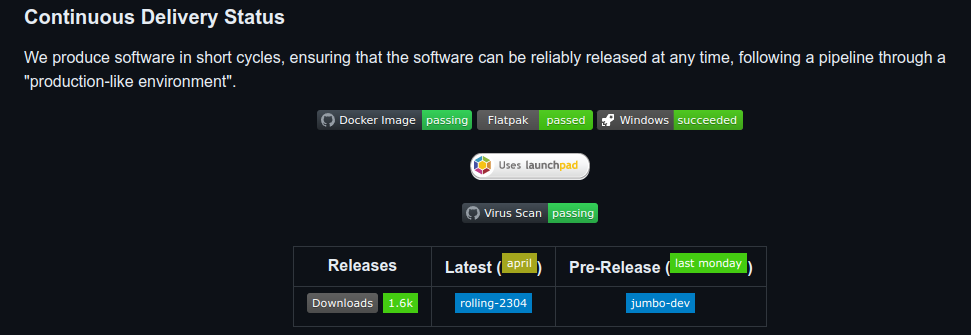

# Subject: John the Ripper binary packages

This is in fact nothing new for the list, but we would like to announce the existence of John the Ripper compiled packages:

- git repository at [https://github.com/openwall/john-packages.](https://github.com/openwall/john-packages)
- there are a stable release, a rolling release [1], and a development release;
- you can find packages:
  - in PortableApp style: for Windows and Mac;
  - in sandboxed style [2]: for Linux;
    - a Canonical snap (the recommended), a flatpak and a Docker image (the recommended method for use in the cloud ☁);

What these packages offer:

- the deployment process and scripts used are public and are evaluated by Static Code Analyzers;
- the VM images used for the build are produced by leaders players, for example, the disk image used in the Windows package build is created by the Microsoft (Azure) team, the Mac X86 by the Circle Internet Services, Inc; well known and very active in Asia;
- automatic virus scanned by VirusTotal;

Image (from readme):

Hardening:

- it's known [3] that `john` isn't to be used on untrusted inputs, but how about use hardening with `john`?
  - our Linux packages execute in a sandbox which limits the system privileges so that if a malicious content manages exploits a vulnerability to execute arbitrary code it will be unable to compromise the underlying OS.
  - in addition, some packages use binary hardening techniques [4];

The packages and usage guidelines are available for use by the community at [https://github.com/openwall/john-packages.](https://github.com/openwall/john-packages)

We appreciate your input and feedback. Greetings everyone.

- [1] Rolling release, also known as rolling update or continuous delivery, is a concept in software development of
  frequently delivering updates to applications. This is in contrast to a standard or point release.
- [2] In computer security, a sandbox is a security mechanism for separating running programs, usually in an effort
  to mitigate system failures and/or software vulnerabilities from spreading.
- [3] [https://github.com/openwall/john-packages/security/policy](https://github.com/openwall/john-packages/security/policy) I think magnum said this.
- [4] [https://en.wikipedia.org/wiki/Hardening\_(computing)](<https://en.wikipedia.org/wiki/Hardening_(computing)>)
